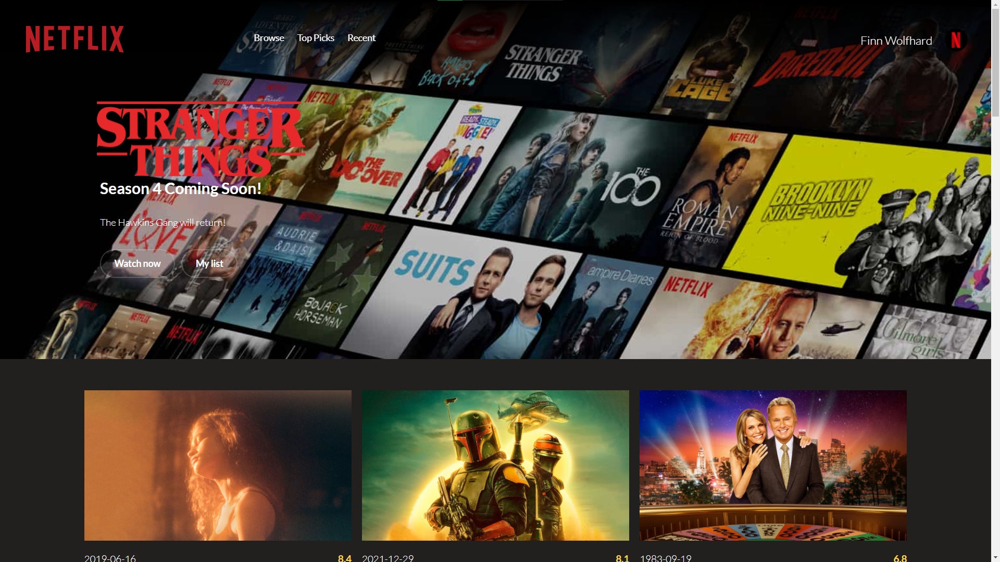

# React Progressive Web App with Webpack Tutorial
This repository contains a Netflix-like emulator progressive web app built with React. The project follows part one of the Udemy course: [React Progressive Web App With Workbox and Webpack Tutorial](https://www.udemy.com/course/react-progressive-web-app-with-workbox-and-webpack-tutorial/)

You can build the application yourself to check it out or use the below-linked demo site to preview it.
Both cases are provided below!

## Demo It 📺
...using the dope hosting service Vercel!
[Click here](https://react-progressive-web-app-tutorial.vercel.app/)

## Build It 🏗
1. Clone this repository `git clone https://github.com/jerelhenderson/react-progressive-web-app-tutorial` and hop into the directory
2. You'll need an API key from [TMDB](https://developers.themoviedb.org/3/getting-started/introduction). Don't worry - it's free!
3. Paste your newly created key into the `.env-example` file, then `Save As` the file as `.env`
4. Run `npm install` to grab the required dependencies

## Run It 🏃🏿‍♂️
5. Use `npm run dev` to start the server at [http://localhost:8080/](http://localhost:8080)